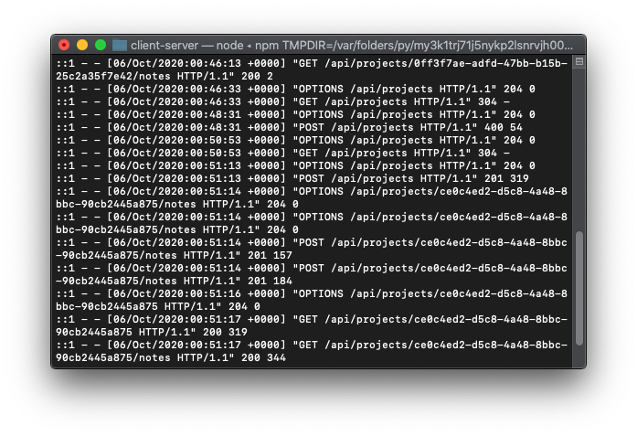

# Client (Server)

<a href="https://client-sandy.vercel.app" title="Client (Server)">
  
</a>

 <p align="center"><a href="https://client-sandy.vercel.app">Live App</a><br><br>📚 Manage clients, projects, documentation and more in one easy to access website<br>For freelancers and small digital agencies.</p>

## Motivation

Inspired by my need to start a business and have everything client related in one place for accessibility and clarity.

## Features

- Sign up for your brand
- Request a web project in a easy to use form (instead of emails cobbled together specs)
- See updates made to the project via the project detail
- Responsive design

TODO:

- Chat
- Email Notifications
- Invoicing
- Stripe & Paypal Support
- Reporting

## Tech Stack

- HTML
- CSS
- Javascript
- React
- PostgreSQL
- Express

## Installation & Development

### Postgres

If you don't already have a postgres on your computer follow instructions here.

- [Install Postgres](https://www.postgresql.org/download/)
- Run server with (macOS & Linux) `pg_ctl -D /usr/local/var/postgres start` or (Windows) `psql`
- Then create `postgres` user in terminal or cmd with `createuser -Pw --interactive `
- Then run `createdb -U postgres client`

Potentially more in depth instructions:

[MacOS & Ubuntu](https://www.digitalocean.com/community/tutorials/how-to-install-postgresql-on-ubuntu-20-04-quickstart)

[Windows](https://www.postgresql.org/download/windows/)

> The installer is designed to be a straightforward, fast way to get up and running with PostgreSQL on Windows.

### Application

You'll need run this before client in order for the application to work completely. Also, may need to run `npm install postgrator -D`.

- Clone from [`https://github.com/joshuaakanetuk/client-server`](https://github.com/joshuaakanetuk/client-server)
- `cd` into `client-server`
- Run `npm i`
- Run `npm run migrate` to create tables
- (Optionally, needed for admin/client) Run seeds in folder `/seeds/` — `psql -d client -f ./seeds/seed.client_<INSERT_DATA_MODEL>.sql `

<br>

## API Documentation

All required variables are included in each request.

### Projects Endpoints

### ▸ `GET /api/projects`

Returns an array of projects (if you are a client you will only get your projects.)

**Example Response**

```
[
    {
        "id": "2190f1c9-bb49-4182-8baa-6c17ce6e6a86",
        "name": "Hartweg's Sundrops",
        "status": "INITIAL",
        "deliverables": "Documentation",
        "admin_approval": false,
        "client_approval": false,
        "end_timeframe": "2021-01-15T03:47:56.000Z",
        "type": "Online Store",
        "price": 283.52,
        "proposal": "",
        "date_created": "2020-10-19T08:12:57.000Z",
        "user_id": 2
    },
    ...
]
```

### ▸ `POST /api/projects`

Posting to the endpoint creates a project.

**Example Request**

```
{
    "id": "e78dd657-271a-45a1-b59f-1824c4a42f37",
    "name": "A NEW THING",
    "status": "INITAL",
    "deliverables": "Shopify",
    "admin_approval": true,
    "client_approval": false,
    "end_timeframe": "2020-12-24T20:12:43.000Z",
    "type": "Portfolio",
    "price": 123704,
    "proposal": "",
    "date_created": "2020-04-29T17:42:17.000Z",
    "user_id": 1
}
```

**Example Response**

Endpoint returns 201 and request on success.

### ▸ `GET /api/projects/:projectId`

Returns project in object form.

**Example Response**

```
{
    "id": "066d17ba-302d-4c77-a8b9-0ea4739d482a",
    "name": "A NEW THING",
    "status": "INITAL",
    "deliverables": "Shopify",
    "admin_approval": true,
    "client_approval": false,
    "end_timeframe": "2020-12-24T20:12:43.000Z",
    "type": "Portfolio",
    "price": 123704,
    "proposal": "",
    "date_created": "2020-04-29T17:42:17.000Z",
    "user_id": 1
}
```

### ▸ `PATCH /api/projects/:projectId`

Allows edits to existing projects.

**Example Request**

```
{
   "name":"A NEW NAME"
}
```

**Example Response**

```
{
    "id": "066d17ba-302d-4c77-a8b9-0ea4739d482a",
    "name": "A NEW NAME",
    "status": "INITAL",
    "deliverables": "Shopify",
    "admin_approval": true,
    "client_approval": false,
    "end_timeframe": "2020-12-24T20:12:43.000Z",
    "type": "Portfolio",
    "price": 123704,
    "proposal": "",
    "date_created": "2020-04-29T17:42:17.000Z",
    "user_id": 1
}
```

### ▸ `GET /api/projects/:projectId/notes`

Returns an array of notes for listed project.

**Example Response**

```
[
    {
        "id": 1,
        "content": "sdfsf",
        "type": "notes",
        "date_created": "2020-10-06T00:51:13.979Z",
        "created_by": "client",
        "project_id": "ce0c4ed2-d5c8-4a48-8bbc-90cb2445a875"
    },
    {
        "id": 2,
        "content": "I''m Client proposed project",
        "type": "changelog",
        "date_created": "2020-10-06T00:51:13.980Z",
        "created_by": "client",
        "project_id": "ce0c4ed2-d5c8-4a48-8bbc-90cb2445a875"
    }
]
```

### User Endpoints

### ▸ `POST /api/users`

Allows you to create a new user. Returns user object.

**Example Request**

```
{
    "full_name": "I'm Client",
    "user_name": "client",
    "type": "admin",
    "email": "client@gmail.com"
}
```

**Example Response**

```
{
    "id": 11,
    "full_name": "I'm Client",
    "user_name": "client1",
    "type": "admin",
    "email": "client@gmail.com",
    "date_created": "2020-10-06T23:15:52.365Z"
}
```

### Notes Endpoints

### ▸ `POST /api/notes/:noteId`

Allows you to delete notes.

**Example Response**

```
204 No Content!
```

### Auth Endpoints

### ▸ `POST /api/login`

Allows you to login into server.

**Example Request**

```
{
    "user_name":"admin",
    "password": "passwOrd1@"
}
```

**Example Response**

```
{
    "user": {
        "type": "admin",
        "user_id": 1
    },
    "authToken": "..."
}
```

## Copyright

Copyright 2020, Joshua Akan-Etuk.

<br>

<p align="center"><a href="https://joshuaakanetuk.com" title="Joshua Akan-Etuk">
  
</a></p>
